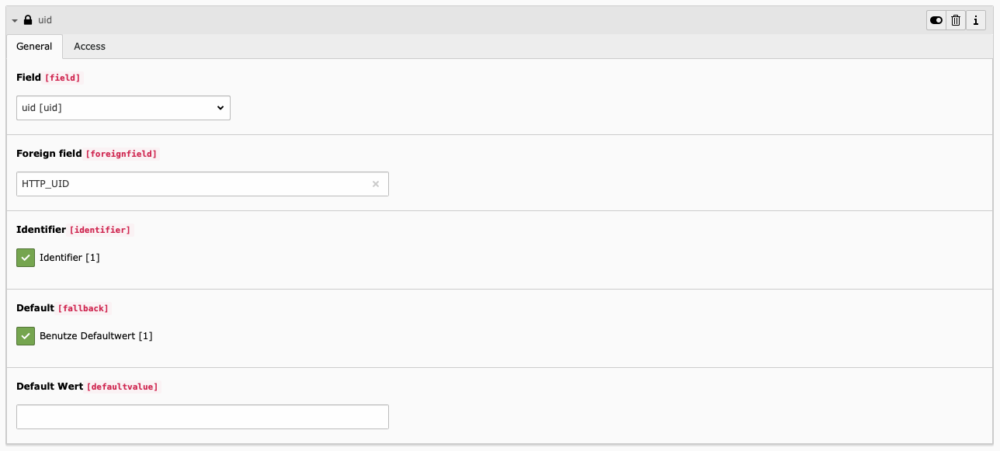

Configuration
=============

Service Provider
****************

If you want to add a new configuration to use a service provider, it is possible to add this as new record in the list
view.
The serviceprovider is located under SAML Authentcation.

There are several fields. After you filled in the first data and saved it for the first time, maybe there comes some
additional fields. For example if you choose the Apache2 Shibbolet SP the field Prefix will show up.

.. image:: _static/Images/Serviceprovider.png

Title
  In this field you can enter a title for the Configuration.
Type
  Currently there is only the Apache version available. So there is only the possibility to communicate with the
  Service Provider on your system over environment variables.
Identityprovider
  Here you have to fill in the correct value title of your Identityprovider. (For the Apache2 ServiceProvider the fieldname is
  'Shib-Identity-Provider')
Context
  This select field let you choose wether the Service Provider should only work for frontend, backend or booth.
Table Mapping
  Here you have to add the mappings from the Service Provider Data to the TYPO3 Tables.
Destination PID
  This is the page where the users should be stored.
Prefix
  If you prefix your variables, this prefix can be added here.
Access
  With this field you can regulate wether this entry should be active or not.

Table mapping
*************

You are able to insert data in every table which is accessable by TYPO3.

.. image:: _static/Images/Tablemapping.png

Table Name
  Here you have to choose the table in which you want to insert.
Field mapping
  Now you can add for every field a mapping rule.
Access
  With this field you can regulate wether this entry should be active or not.

Field mapping
*************

With this you can map the values from the Service Provider to the fields of the table.

.. warning::
    There exists an error when you safe the first time. These error is not a problem but I wasn't able to remove it.
    You can read more here: :ref:`bugs-and-feature-request-label`.

Field
  The field name in the table. Before you haven't safed it there will no fields will be shown.
Foreign field
  The field name in the collection of foreign fields.
Identifier
  The checkbox value should only used once and represent the field which should used as identifier.
  (I hadn't tried it multi times.)
Default
  If this checkbox is checked then a input field will appear where you are able to fill in any default Value
Access
  With this field you can regulate wether this entry should be active or not.

.. tip::
    If you want to save new users in the database you have to add at least one group to the user. Because if a user
    doesn't have a group he will not be able to login.